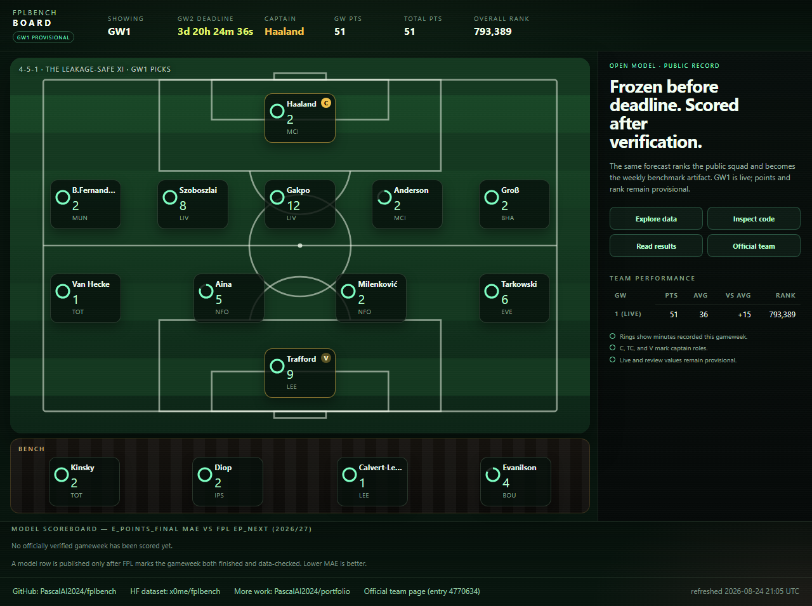

<p align="center">
  <a href="https://huggingface.co/spaces/x0me/fplbench-board">
    
  </a>
</p>

# fplbench

[](https://github.com/PascalAI2024/fplbench/actions/workflows/quality.yml)
[](https://github.com/PascalAI2024/fplbench/actions/workflows/fplbench.yml)

Leakage-aware Fantasy Premier League player-fixture data, reproducible
LightGBM forecasts, and a public post-gameweek scoring record.

[Live board](https://huggingface.co/spaces/x0me/fplbench-board) ·
[Dataset](https://huggingface.co/datasets/x0me/fplbench) ·
[Results](RESULTS.md) ·
[Frozen forecasts](outputs/predictions/) ·
[Official team](https://fantasy.premierleague.com/entry/4770634/history) ·
[Portfolio](https://github.com/PascalAI2024/portfolio)

The operating contract is simple: generate and commit the forecast before the
deadline, run the model's squad, then grade `e_points_final` only after FPL
marks the gameweek both `finished` and `data_checked`.

```python
from datasets import load_dataset

ds = load_dataset("x0me/fplbench")
train, validation = ds["train"], ds["validation"]
```

---

## Why this exists

FPL models are easy to evaluate badly. Same-gameweek statistics can leak the
answer, double-gameweek fixtures can contaminate each other's lags, and a live
score can move while FPL reviews the event. This project makes those boundaries
testable and public. It models minutes, points, and Defensive Contribution
(DefCon), publishes the historical panel, and exposes its live record.

---

## Holdout metrics (2025-26)

First-party historical holdout evidence, rebuilt after the DGW lag repair.
Common mask: `total_points`, `pred_points`, last-5 baseline, and `xp_scraped`
all finite. Source: [`outputs/models/val_metrics.json`](outputs/models/val_metrics.json).

| Metric | Value | Notes |
|--------|------:|-------|
| **n_common** | 29,417 | rows in the fair comparison |
| **mae_decomposed** | **0.8764** | **published** score (`pred_points_decomposed`) |
| mae_model | 0.9734 | raw points head |
| mae_last5 | 1.0534 | rolling last-5 baseline |
| mae_xp_scraped | 1.0683 | post-match `xP` (not a feature) |
| mae_model_gw1 | 1.4352 | GW1-only cold start |
| defcon_auc | 0.8193 | DefCon hit probability (holdout) |
| defcon_logloss | 0.1942 | after OOF isotonic calibration (raw 0.2488) |
| defcon_brier | 0.0528 | after OOF isotonic calibration (raw 0.0562) |

`pred_defcon` is isotonic-calibrated on 5-fold OOF probabilities from 2025-26 GW ≤ 28 (537 positives). Holdout metrics use GW > 28 only.

Published ranking uses:

```text
pred_points_decomposed = pred_points * clip(pred_minutes / 90, 0, 1)
e_points_final         = pred_points_decomposed + 2 * pred_defcon
e_points_p90           = decompose_points(pred_points_p90, pred_minutes) + 2 * pred_defcon
```


---

## Archived TabFM side study

This pre-repair experiment used the same 2,500 validation rows, 94-feature
context, and stratified sample. It is retained for provenance, not presented
as a result from the corrected DGW-safe pipeline. Source:
[`outputs/predictions/tabfm_vs_lgbm.json`](outputs/predictions/tabfm_vs_lgbm.json).

| Model | MAE (all) | MAE played (n=946) | MAE haulers (n=236) |
|-------|----------:|-------------------:|--------------------:|
| **TabFM** | **1.412** | **2.326** | **4.805** |
| LightGBM (same context) | 1.466 | 2.541 | 4.942 |
| last-5 baseline | 1.107 | 2.420 | 5.020 |
| xp_scraped | 1.115 | 2.816 | 6.687 |

**Caveat:** weights are [`google/tabfm-1.0.0-pytorch`](https://huggingface.co/google/tabfm-1.0.0-pytorch) under **tabfm-non-commercial-v1.0** (research only — not for commercial use). The production path in this repo is LightGBM; TabFM is a side comparison.

Corrected full-validation LightGBM holdout (for context):
`mae_model=0.9734` on 29,747 rows. The common-mask table above remains the
published comparison.

---

## Reproduce (3 commands)

```bash
pip install -e .
python scripts/build_all.py
pytest
```

Writes `data/processed/panel.parquet`, `outputs/models/*`, and validation metrics. Optional: `pip install -e ".[dev]"` if you want an explicit dev extra.

---

## Leakage rule

vaastav `xP` is scraped from FPL `ep_this` **after** the gameweek. Managers did not have it at the deadline.

- Stored as `xp_scraped`
- **Never train on it**
- Used only as a contaminated baseline

Every performance feature is shifted inside `(season, player_code)`. In a
double gameweek, both fixture rows receive the same lag values that were known
before the gameweek's first fixture; the second fixture cannot observe the
first. Feature names end in `_l1`, `_r3`, `_r5`. Live comparison uses
pre-deadline `ep_next`, also never fed to the model.

---

## DefCon labels

Official 2025/26–2026/27 rule (live API):

| Position | Count | Threshold | Points |
|----------|-------|-----------|--------|
| DEF | CBIT | 10 | 2 |
| MID / FWD | CBIT + recoveries | 12 | 2 |
| GK | — | never | 0 |

---

## Frozen GW1 squad

Legal 15-man squad from `outputs/predictions/gw1_2026-27.csv` (£100.0m, ≤3/club, 2/5/5/3), maximizing `e_points_final`.

| | |
|--|--|
| **Cost** | £100.0m |
| **Σ e_points_final** | 78.923 |
| **Captain** | Haaland |
| **Reproduce** | `python scripts/pick_squad.py` |

Full XI, bench, and constraint check: [`outputs/squad_gw1.md`](outputs/squad_gw1.md). Pitch board: [`docs/wow/gw1_pitch.html`](docs/wow/gw1_pitch.html).

The current GW1 prediction file is byte-identical to the forecast first
committed [before the deadline](https://github.com/PascalAI2024/fplbench/commit/4b970a812deb997d32e48f9e48d9520b6a5ab901).
Git history also preserves a post-deadline overwrite and the
[explicit restoration](https://github.com/PascalAI2024/fplbench/commit/2981de109ce7b57f8ccc75ed1c011eb16886fc3a).
The current freeze guard rejects post-deadline overwrites of an existing board.

---

## Dataset / Space / Live team

| Artifact | Link |
|----------|------|
| Dataset | https://huggingface.co/datasets/x0me/fplbench |
| Responsive benchmark board | https://huggingface.co/spaces/x0me/fplbench-board |
| **The model's own FPL team** | https://fantasy.premierleague.com/entry/4770634/history |
| Portfolio | https://github.com/PascalAI2024/portfolio |

The published squad is represented by *The Leakage-Safe XI* in the official
FPL game. Live points and rank remain provisional until FPL completes its
review; the public board labels that state explicitly.

The corrected export contains **139,029 rows and 165 columns**: 109,282 train
rows and 29,747 validation rows. Its fixture key, same-GW lag contract, schema,
row counts, and SHA-256 hashes are recorded in `manifest.json`. Weekly scoring
of the published `e_points_final` forecast vs FPL's own `ep_next` lands in
[`RESULTS.md`](RESULTS.md) only after official verification.

---

## Limitations

| Limit | Detail |
|-------|--------|
| **GW1 cold start** | `mae_model_gw1 = 1.4352` — no in-season form yet |
| **One DefCon season** | Labels only from 2025-26; classifier train uses GW ≤ 28, holdout GW > 28 |
| **Live DGW not implemented** | Historical DGW lags are safe; live double-gameweek prediction still raises `NotImplementedError` |
| **TabFM non-commercial** | `google/tabfm-1.0.0-pytorch` — research license only |
| **Set-piece orders** | `penalties_order`, `corners_and_indirect_freekicks_order`, `direct_freekicks_order` exist in vaastav `players_raw.csv` for 2021-22…2025-26, but those files are **end-of-season snapshots**. Features use **prior-season** orders by `player_code` (first season / new players → 0). Live 2026-27 uses 2025-26. Same-season snapshot values are never treated as known mid-season. |

---

## Data & splits

| Source | Role |
|--------|------|
| [vaastav](https://github.com/vaastav/Fantasy-Premier-League) 2021-22 … 2025-26 `merged_gw` + `players_raw` | historical panel; set-piece orders are prior-season only (see Limitations) |
| Official FPL API | live prices, news, fixtures, `ep_next`, event-live actuals |
| [olbauday/FPL-Core-Insights](https://github.com/olbauday/FPL-Core-Insights) | planned join (cups, Elo, GW0 friendlies) |

| Split | Seasons | Use |
|-------|---------|-----|
| train | 2021-22 … 2024-25 | fit points + minutes |
| validation | 2025-26 | first full DefCon season |
| live | 2026-27 | weekly API scoring → `RESULTS.md` |

**Cite vaastav** if you use the panel. Player data is owned by the Premier League / its providers. Research and personal modelling only.

---

## Layout

```text
fplbench/           # package (panel, train, predict, score, squad)
scripts/
  build_all.py      # full rebuild
  predict_live.py   # live GW board
  score_gw.py       # → RESULTS.md
  pick_squad.py     # ILP 15-man
  compare_tabfm.py  # TabFM side study
  make_charts.py    # → docs/img/*.png
  make_wow.py       # → docs/wow/gw1_pitch.html
  make_social.py    # → docs/img/social.png
RESULTS.md          # verified GW model scores + provisional team rows
outputs/models/     # joblibs + val_metrics.json
outputs/predictions/
docs/img/           # charts + social.png (pitch-board preview)
docs/wow/           # GW1 pitch board
```

Live score after a finished and data-checked GW:

```bash
python scripts/score_gw.py --gw 1 --preds outputs/predictions/gw1_2026-27.csv
```

## Lineup automation (local)

The starting XI of the live team (entry 4770634) is set by a Windows scheduled
task on the operator machine, not by CI:

- `scripts/friday_lineup.cmd` pipes `scripts/friday_lineup.prompt.md` into a
  headless Claude run. Three self-gating schtasks slots fire per week because
  FPL deadlines move around.
- **Deadline gate**: each run first reads the next deadline from the public
  bootstrap API and exits unless it is 20 minutes to 36 hours away (and not
  already applied for that GW), so extra slots are harmless no-ops.
- It only reorders the owned 15 (formation-valid XI + captain/vice + bench
  order, maximizing `e_points_final` from the latest committed predictions).
  **Transfers are never applied automatically** — at most a suggestion is
  written to the log.
- Requires Chrome open and logged into fantasy.premierleague.com on the
  operator machine (the run uses the existing browser session; it never
  handles credentials). Each run appends to `outputs/friday_lineup_log.md`.
