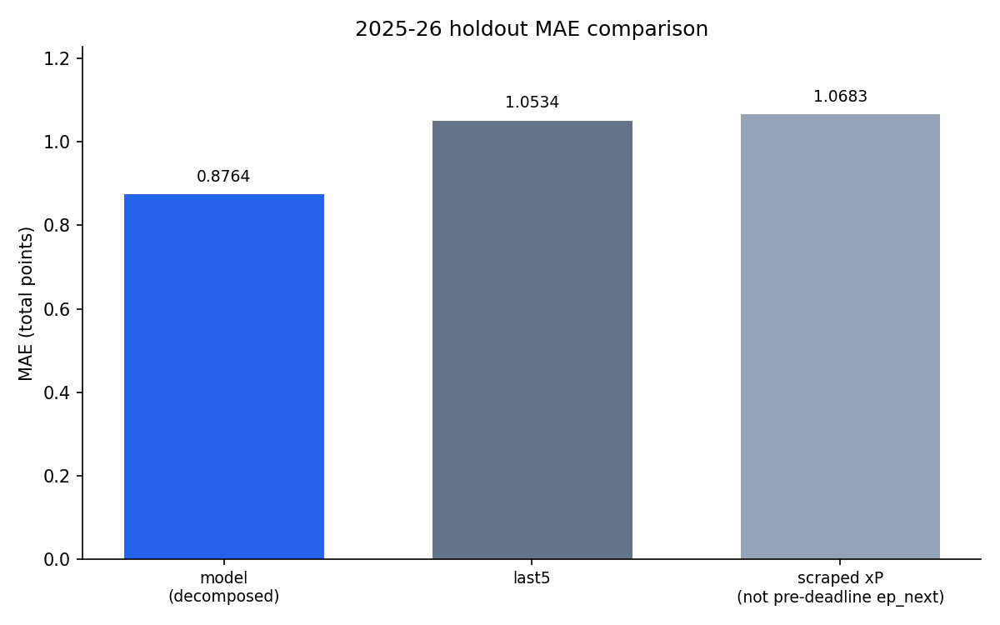
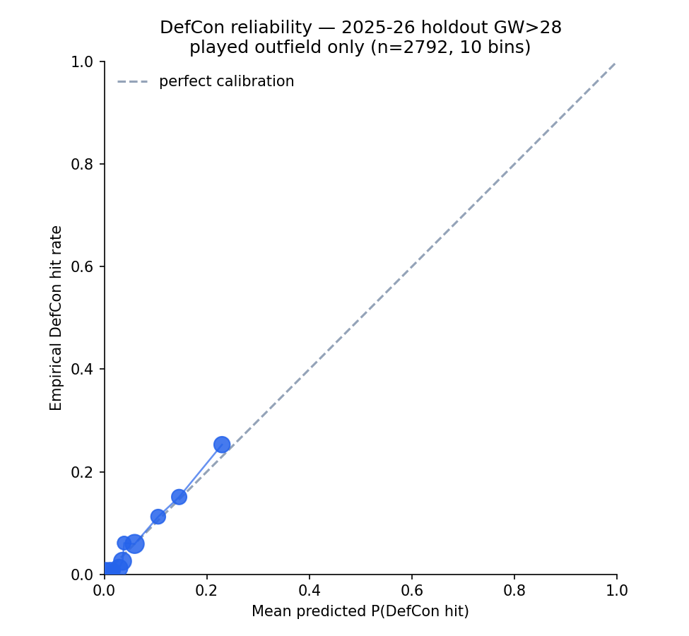
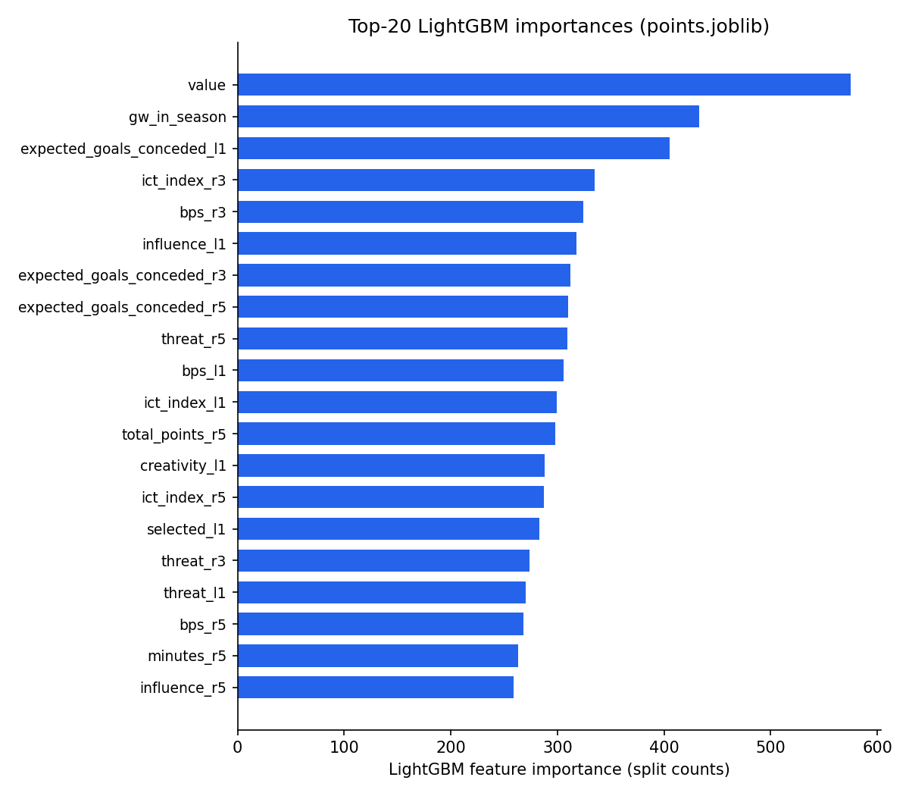

# fplbench

[](https://github.com/PascalAI2024/fplbench/actions/workflows/fplbench.yml)

**First open DefCon-aware Fantasy Premier League model** — predicts minutes, Defensive Contribution (DefCon), and points on a leakage-safe player-gameweek panel.

Live self-scoring: after each GW, `python scripts/score_gw.py` joins predictions to official FPL actuals and appends a row to [`RESULTS.md`](RESULTS.md). No hand-waving — the board updates itself.

GW1 deadline: **Friday 21 August 2026, 18:30 UK**.

---

## Why this exists

Predicting next-GW points on [vaastav](https://github.com/vaastav/Fantasy-Premier-League) CSVs is a crowded genre. Two gaps remain:

1. No proper public FPL tabular dataset on Hugging Face (existing merges are schema-broken and train on post-match `xP`).
2. Open models under-model **who plays** and **DefCon** (year 2 of the rule). Commercial tools still win on minutes; OpenFPL (arXiv:2508.09992) said so in public.

This repo attacks both.

---

## Holdout metrics (2025-26)

Common mask — `total_points`, `pred_points`, last-5 baseline, and `xp_scraped` all finite. Source: [`outputs/models/val_metrics.json`](outputs/models/val_metrics.json).

| Metric | Value | Notes |
|--------|------:|-------|
| **n_common** | 29 428 | rows in the fair comparison |
| **mae_decomposed** | **0.8757** | **published** score (`pred_points_decomposed`) |
| mae_model | 0.9740 | raw points head |
| mae_last5 | 1.0534 | rolling last-5 baseline |
| mae_xp_scraped | 1.0683 | post-match `xP` (not a feature) |
| mae_model_gw1 | 1.4364 | GW1-only cold start |
| defcon_auc | 0.818 | DefCon hit probability (holdout) |
| defcon_logloss | 0.1931 | after OOF isotonic calibration (raw 0.2436) |
| defcon_brier | 0.0527 | after OOF isotonic calibration (raw 0.0564) |

`pred_defcon` is isotonic-calibrated on 5-fold OOF probabilities from 2025-26 GW ≤ 28 (537 positives). Holdout metrics use GW > 28 only.

Published ranking uses:

```text
pred_points_decomposed = pred_points * clip(pred_minutes / 90, 0, 1)
e_points_final         = pred_points_decomposed + 2 * pred_defcon
e_points_p90           = decompose_points(pred_points_p90, pred_minutes) + 2 * pred_defcon
```







---

## TabFM vs LightGBM

Same 2 500 validation rows, 94 features, stratified context. Source: [`outputs/predictions/tabfm_vs_lgbm.json`](outputs/predictions/tabfm_vs_lgbm.json).

| Model | MAE (all) | MAE played (n=946) | MAE haulers (n=236) |
|-------|----------:|-------------------:|--------------------:|
| **TabFM** | **1.412** | **2.326** | **4.805** |
| LightGBM (same context) | 1.466 | 2.541 | 4.942 |
| last-5 baseline | 1.107 | 2.420 | 5.020 |
| xp_scraped | 1.115 | 2.816 | 6.687 |

**Caveat:** weights are [`google/tabfm-1.0.0-pytorch`](https://huggingface.co/google/tabfm-1.0.0-pytorch) under **tabfm-non-commercial-v1.0** (research only — not for commercial use). The production path in this repo is LightGBM; TabFM is a side comparison.

Full-data LightGBM holdout (for context): `mae_model≈0.980` on 29 757 rows — the common-mask table above is the honest published number.

---

## Reproduce (3 commands)

```bash
pip install -e .
python scripts/build_all.py
pytest
```

Writes `data/processed/panel.parquet`, `outputs/models/*`, and validation metrics. Optional: `pip install -e ".[dev]"` if you want an explicit dev extra.

---

## Leakage rule

vaastav `xP` is scraped from FPL `ep_this` **after** the gameweek. Managers did not have it at the deadline.

- Stored as `xp_scraped`
- **Never train on it**
- Used only as a contaminated baseline

Every performance feature is shifted one gameweek inside `(season, player_code)`. Feature names end in `_l1`, `_r3`, `_r5`. Live comparison uses pre-deadline `ep_next`, also never fed to the model.

---

## DefCon labels

Official 2025/26–2026/27 rule (live API):

| Position | Count | Threshold | Points |
|----------|-------|-----------|--------|
| DEF | CBIT | 10 | 2 |
| MID / FWD | CBIT + recoveries | 12 | 2 |
| GK | — | never | 0 |

---

## GW1 squad

Legal 15-man squad from `outputs/predictions/gw1_2026-27.csv` (£100.0m, ≤3/club, 2/5/5/3), maximizing `e_points_final`.

| | |
|--|--|
| **Cost** | £100.0m |
| **Σ e_points_final** | 78.923 |
| **Captain** | Haaland |
| **Reproduce** | `python scripts/pick_squad.py` |

Full XI, bench, and constraint check: [`outputs/squad_gw1.md`](outputs/squad_gw1.md). Pitch board: [`docs/wow/gw1_pitch.html`](docs/wow/gw1_pitch.html).

Social / Open Graph preview: [`docs/img/social.png`](docs/img/social.png) (Playwright screenshot of `#board` on that pitch page).

---

## Dataset / Space / Live team

| Artifact | Link |
|----------|------|
| Dataset | https://huggingface.co/datasets/x0me/fplbench |
| GW1 pitch board | https://huggingface.co/spaces/x0me/fplbench-board |
| **The model's own FPL team** | https://fantasy.premierleague.com/entry/4770634/event/1 |

**The model plays its own picks.** The squad in [`outputs/squad_gw1.csv`](outputs/squad_gw1.md) is entered in the official FPL game as *The Leakage-Safe XI* — no manual overrides. The team page above goes live when GW1 kicks off (Fri 21 Aug 2026); its score is the model's score, against ~4.7M human managers.

The panel export is at `data/processed/hf/`. Weekly self-scoring vs FPL's own `ep_next` lands in [`RESULTS.md`](RESULTS.md) (first data row after GW1).

---

## Limitations

| Limit | Detail |
|-------|--------|
| **GW1 cold start** | `mae_model_gw1 = 1.4364` — no in-season form yet |
| **One DefCon season** | Labels only from 2025-26; classifier train uses GW ≤ 28, holdout GW > 28 |
| **DGW not implemented** | Double gameweeks raise `NotImplementedError` in `predict.py` |
| **TabFM non-commercial** | `google/tabfm-1.0.0-pytorch` — research license only |
| **Set-piece orders** | `penalties_order`, `corners_and_indirect_freekicks_order`, `direct_freekicks_order` exist in vaastav `players_raw.csv` for 2021-22…2025-26, but those files are **end-of-season snapshots**. Features use **prior-season** orders by `player_code` (first season / new players → 0). Live 2026-27 uses 2025-26. Same-season snapshot values are never treated as known mid-season. |

---

## Data & splits

| Source | Role |
|--------|------|
| [vaastav](https://github.com/vaastav/Fantasy-Premier-League) 2021-22 … 2025-26 `merged_gw` + `players_raw` | historical panel; set-piece orders are prior-season only (see Limitations) |
| Official FPL API | live prices, news, fixtures, `ep_next`, event-live actuals |
| [olbauday/FPL-Core-Insights](https://github.com/olbauday/FPL-Core-Insights) | planned join (cups, Elo, GW0 friendlies) |

| Split | Seasons | Use |
|-------|---------|-----|
| train | 2021-22 … 2024-25 | fit points + minutes |
| validation | 2025-26 | first full DefCon season |
| live | 2026-27 | weekly API scoring → `RESULTS.md` |

**Cite vaastav** if you use the panel. Player data is owned by the Premier League / its providers. Research and personal modelling only.

---

## Layout

```text
fplbench/           # package (panel, train, predict, score, squad)
scripts/
  build_all.py      # full rebuild
  predict_live.py   # live GW board
  score_gw.py       # → RESULTS.md
  pick_squad.py     # ILP 15-man
  compare_tabfm.py  # TabFM side study
  make_charts.py    # → docs/img/*.png
  make_wow.py       # → docs/wow/gw1_pitch.html
  make_social.py    # → docs/img/social.png
RESULTS.md          # live GW scores (first row after GW1)
outputs/models/     # joblibs + val_metrics.json
outputs/predictions/
docs/img/           # charts + social.png (pitch-board preview)
docs/wow/           # GW1 pitch board
```

Live score after a finished GW:

```bash
python scripts/score_gw.py --gw 1 --preds outputs/predictions/gw1_2026-27.csv
```

## Lineup automation (local)

The starting XI of the live team (entry 4770634) is set by a Windows scheduled
task on the operator machine, not by CI:

- `scripts/friday_lineup.cmd` pipes `scripts/friday_lineup.prompt.md` into a
  headless Claude run. Three self-gating schtasks slots fire per week because
  FPL deadlines move around.
- **Deadline gate**: each run first reads the next deadline from the public
  bootstrap API and exits unless it is 20 minutes to 36 hours away (and not
  already applied for that GW), so extra slots are harmless no-ops.
- It only reorders the owned 15 (formation-valid XI + captain/vice + bench
  order, maximizing `e_points_final` from the latest committed predictions).
  **Transfers are never applied automatically** — at most a suggestion is
  written to the log.
- Requires Chrome open and logged into fantasy.premierleague.com on the
  operator machine (the run uses the existing browser session; it never
  handles credentials). Each run appends to `outputs/friday_lineup_log.md`.
